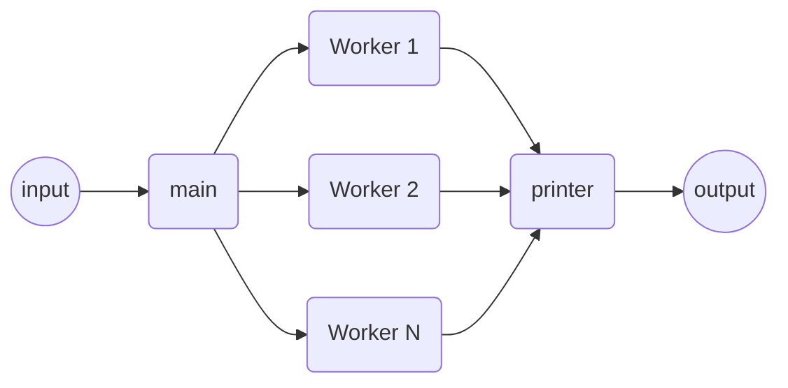

# Square Equation Solver

This program calculates square equation roots and extremum.
Values are passed via standard input, results are printed via standard output.

## Usage

> ./se_solver < test_data
or
> ./se_solver
> -1 2 3
> (-1 2 3) => (-1 3) Xmax=1

## Thread interconnection

## Technical decisions

I decided to split reading input and writing to output to standalone threads to
get better architecture, because homogeneous threads that solving similar
problems is more robust solution.

I decided to pass strings (instead of parsed ints) to workers threads because it would be faster
to parallelize strings decoding too. But it may seem a little bit counter-intuitive, and
more difficult to test. Though, it would be faster. For same reason I pass to printer thread
strings too.

I decided to get slight different solution of quadratic equation to protect
from cases where b is much greater than a*c, and it leads to loss of precision.

## Tests

Tested on input files. Tested with sanitizers: address, undefined, thread.
Sometimes TSan can produce false-positive errors at start. To fix this
change kernel parameter:
> sysctl vm.mmap_rnd_bits=30
Somehow it can frustrate TSan when mmap-ed pages are too far allocated.

